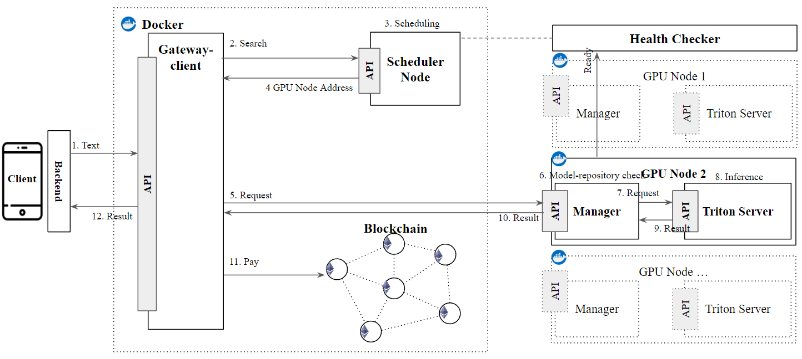

# Triton C++ Example
This is an example of an AI inference server that can scale out using Triton. The blockchain payment system is a bonus.   

## 0. Introduction
Demo video: [LINK](https://www.youtube.com/watch?v=GByNHzyVFS4)   

Nvidia Triton is a very attractive project.   
It supports various AI models while boasting fast speeds.   
However, it is not ideal from a scale-out perspective.   

In this project, we implement a very simple example that addresses the scale-out issue using Nvidia Triton.   
The configuration is as follows:   

| Service | Description |
|:---|:---|
| Frontend <br>+ Backend Server | Provides server code to verify actual operation. |
| Gateway | The entry point for user requests and responses. |
| Scheduler | Schedules which Triton node should handle the request. <br>In this project, a simple round-robin method is used. |
| Triton Node | Consists of two parts: <br>  * Triton Server: Performs inference using AI models. <br>  * Manager: Manages the Triton server. It announces itself with health check messages and forwards requests to the Triton server. |
| Health Checker | Monitors Triton nodes. <br>Continuously creates a list of nodes and provides it to the scheduler. |
| Blockchain-Based Payment System | Implements a payment system. |

## 1. Getting Started
* If there are permission issues, add the 'sudo' keyword.
* The server address can be set in 'setting.json' or the shell script.
---

### 1-1 Backend
```
cd backend
bash quick_start.sh
```
---

### 1-2 Service - Gateway
```
cd service/gateway
bash quick_start.sh
```

### 1-3 Service - Scheduler
```
cd service/scheduler
bash quick_start.sh
```

### 1-4 Service - Health Checker
```
cd service/health-checker
bash quick_start.sh
```
---

### 1-5 Blockchain - Token Manager
```
cd ethereum/token-manager
bash quick_start.sh
```

### 1-6 Blockchain - Ethereum
```
cd ethereum
bash start_ethereum.sh
```
---

### 1-7 GPU Node - Manager
```
cd gpu-node/manager
bash quick_start.sh
```

### 1-8 GPU Node - Triton
```
cd gpu-node
bash start_triton.sh
```
---
* If any issues arise, please post in 'Issues'.

## 2. Open Source Used
| Repository | Description | URL |
|:---|:---|:--:|
| triton-inference-server | Connected to the Manager to serve AI models using Nvidia's Triton. <br>This project uses version 23.12-py3. | [LINK](https://github.com/triton-inference-server/server) |
| go-ethereum | Used go-ethereum to build a private network for a blockchain-based payment system. <br>This project uses version 1.13.15. | [LINK](https://github.com/ethereum/go-ethereum) |